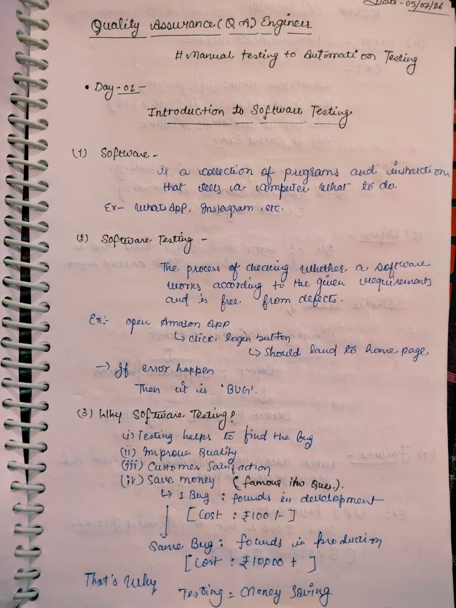
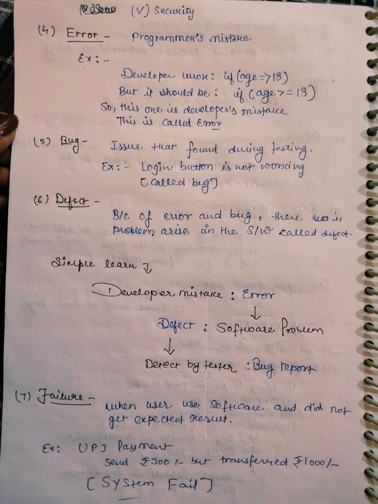
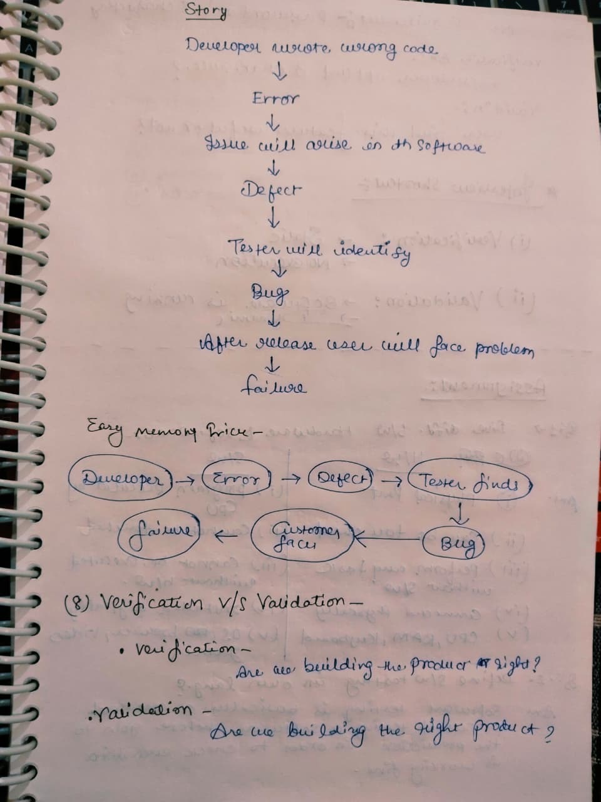
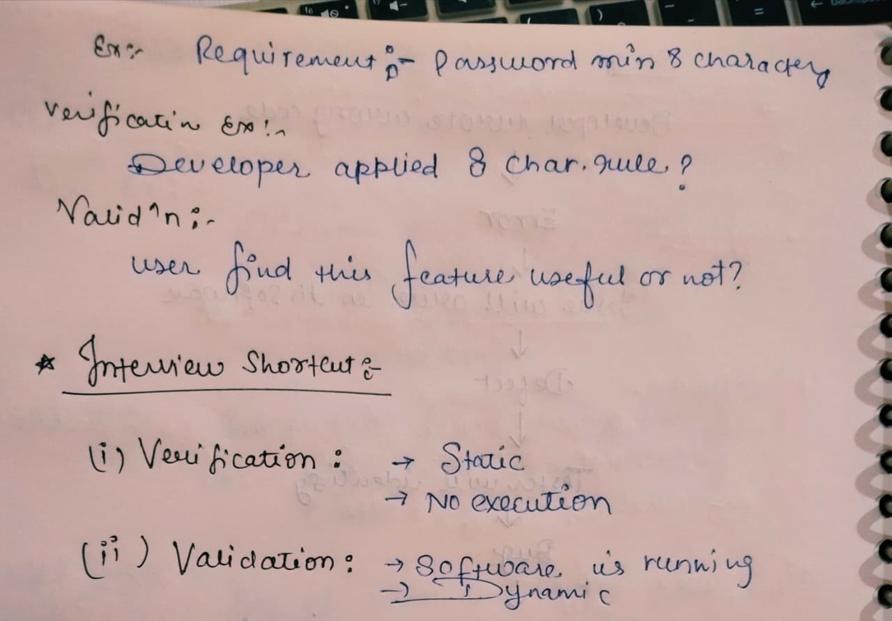

# Day 01 - Software Testing Basics

## 📅 Date
05 July 2026

## 🎯 Topic
Software Testing Basics

## 📚 What I Learned

- What is Software?
- What is Software Testing?
- Why Software Testing is important
- Difference between Error, Defect, Bug, and Failure
- Verification vs Validation

---

# 📝 My Notes

## 1️⃣ Introduction to Software Testing

---

## 2️⃣ Error, Bug, Defect & Failure

---

## 3️⃣ Verification vs Validation (Concept)

---

## 4️⃣ Verification vs Validation (Example)

---

## 🎯 Learning Outcome

Today, I learned the fundamental concepts of Software Testing and understood why testing is an essential part of the software development process.

I also learned the basic terminology used in QA:

- Error
- Defect
- Bug
- Failure
- Verification
- Validation

---

## 📌 Status

✅ Completed

---

**Learning one step at a time 🚀**
