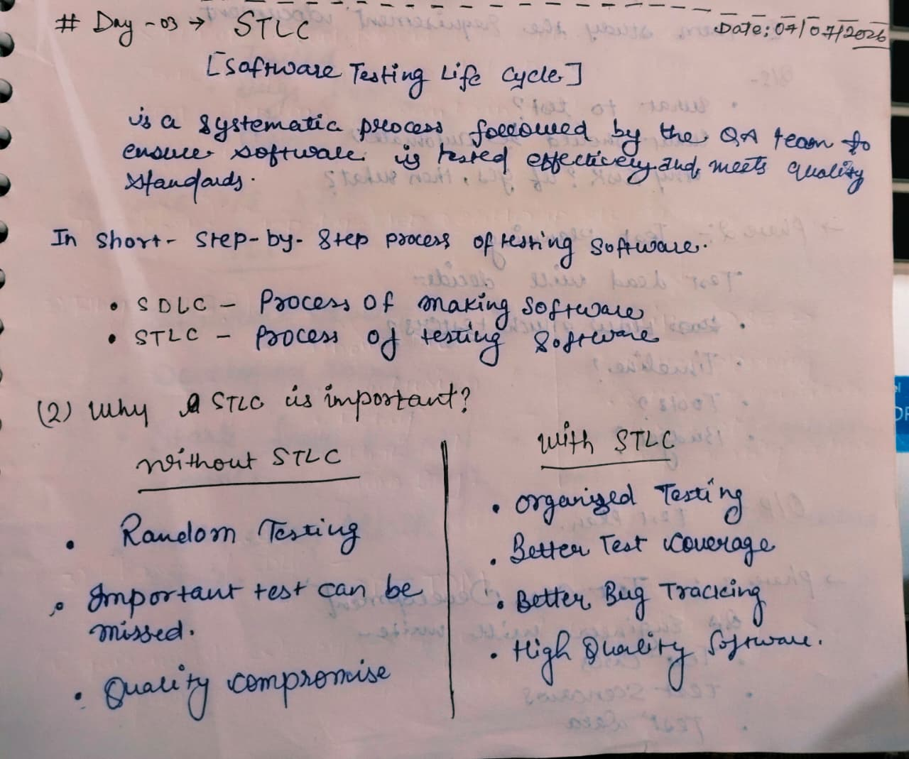
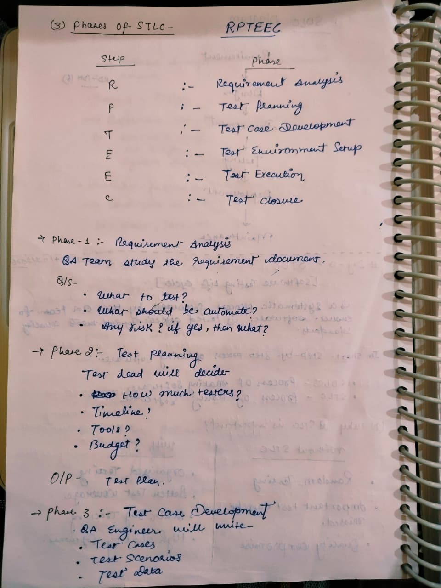
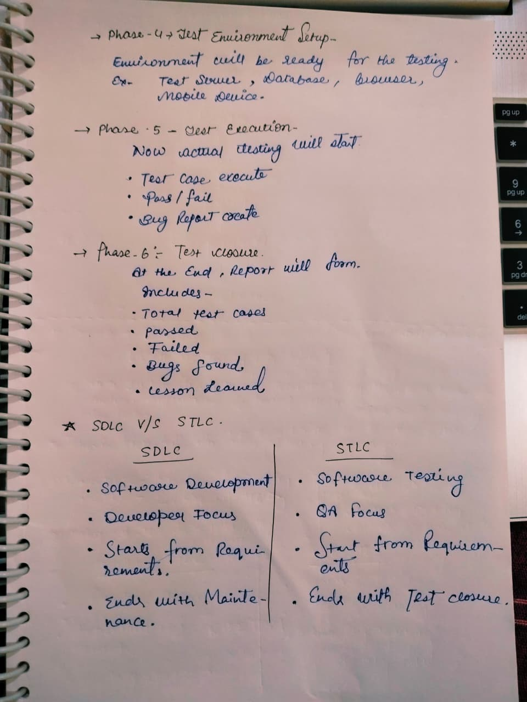

# Day 03 - Software Testing Life Cycle (STLC)

## 📅 Date
07 July 2026

## 🎯 Topic
Software Testing Life Cycle (STLC)

## 📚 What I Learned

- What is STLC?
- Why STLC is important
- Phases of STLC
- Requirement Analysis
- Test Planning
- Test Case Development
- Test Environment Setup
- Test Execution
- Test Closure
- Difference between SDLC and STLC

---

# 📝 My Notes

## 1️⃣ Introduction to STLC

---

## 2️⃣ STLC Phases

---

## 3️⃣ SDLC vs STLC

---

## 🎯 Learning Outcome

Today, I learned the complete Software Testing Life Cycle (STLC) and understood how software testing is performed in a structured manner. I learned each phase of STLC, from Requirement Analysis to Test Closure, and understood the key differences between SDLC and STLC.

I also learned:

- Requirement Analysis
- Test Planning
- Test Case Development
- Test Environment Setup
- Test Execution
- Test Closure
- SDLC vs STLC

---

## 📌 Status

✅ Completed

---

**Learning one step at a time 🚀**
