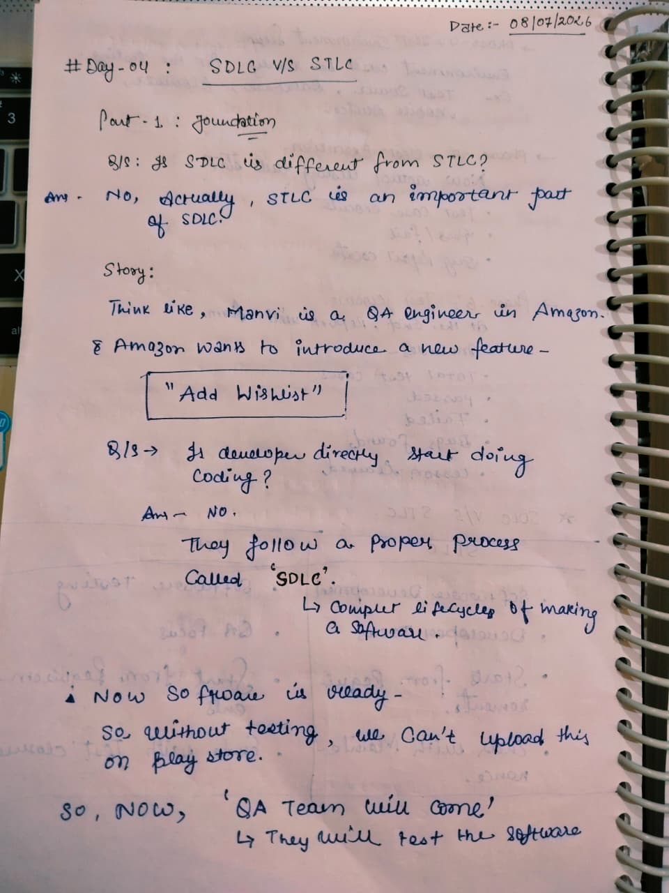
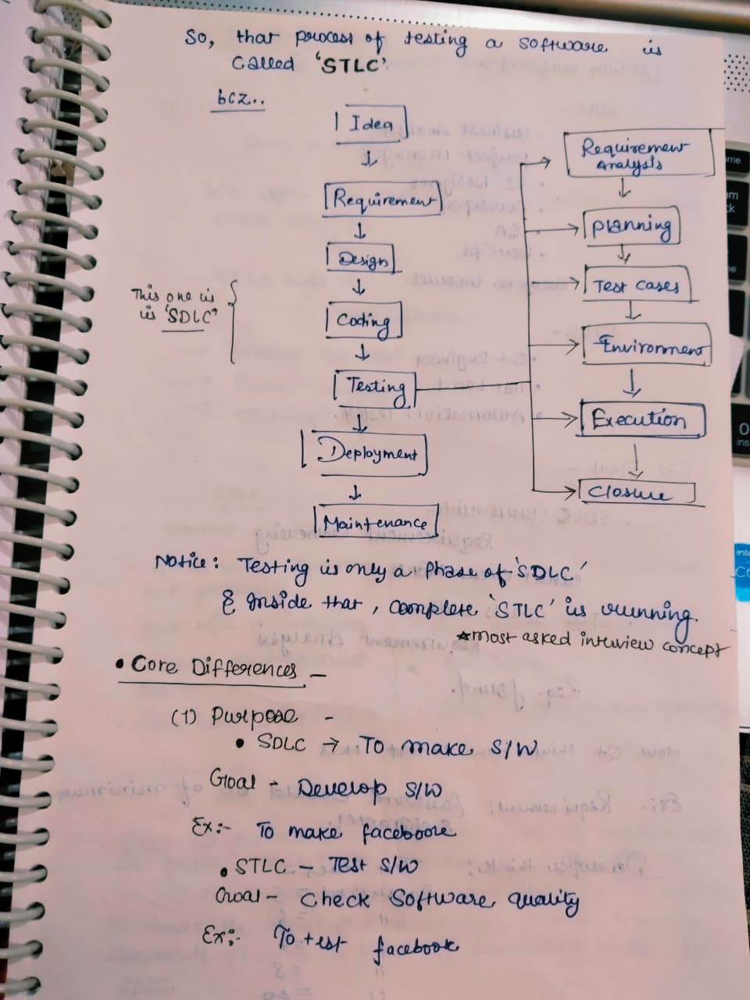
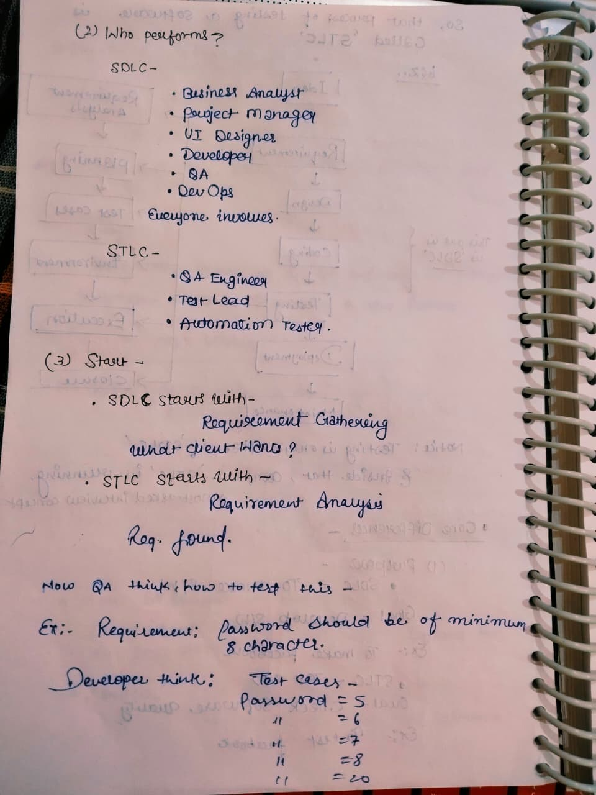
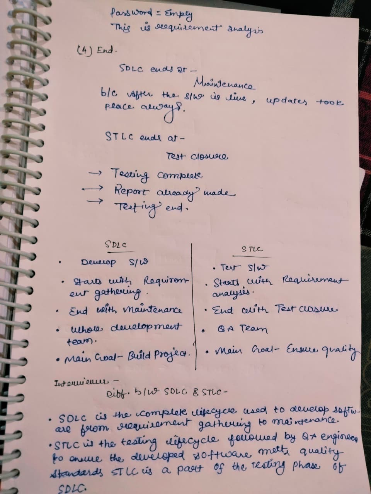

# Day 04 - SDLC vs STLC

## 📅 Date
08 July 2026

## 🎯 Topic
SDLC vs STLC

## 📚 What I Learned

- Relationship between SDLC and STLC
- Why STLC is a part of SDLC
- SDLC Workflow
- STLC Workflow
- Core Differences between SDLC and STLC
- Purpose of SDLC and STLC
- Teams involved in SDLC and STLC
- Starting and Ending phases
- Requirement Gathering vs Requirement Analysis
- Interview Answer for SDLC vs STLC

---

# 📝 My Notes

## 1️⃣ SDLC vs STLC Foundation

---

## 2️⃣ SDLC & STLC Workflow

---

## 3️⃣ Core Differences

---

## 4️⃣ Summary & Interview Notes

---

## 🎯 Learning Outcome

Today, I understood that STLC is an important part of the Testing phase of SDLC rather than a completely separate process.

I learned the key differences between SDLC and STLC based on:

- Purpose
- Team Involved
- Starting Phase
- Ending Phase
- Goals
- Workflow

I also learned how to explain the SDLC vs STLC difference in interviews with practical examples and a structured comparison.

---

## 📌 Status

✅ Completed

---

**Learning one step at a time 🚀**
