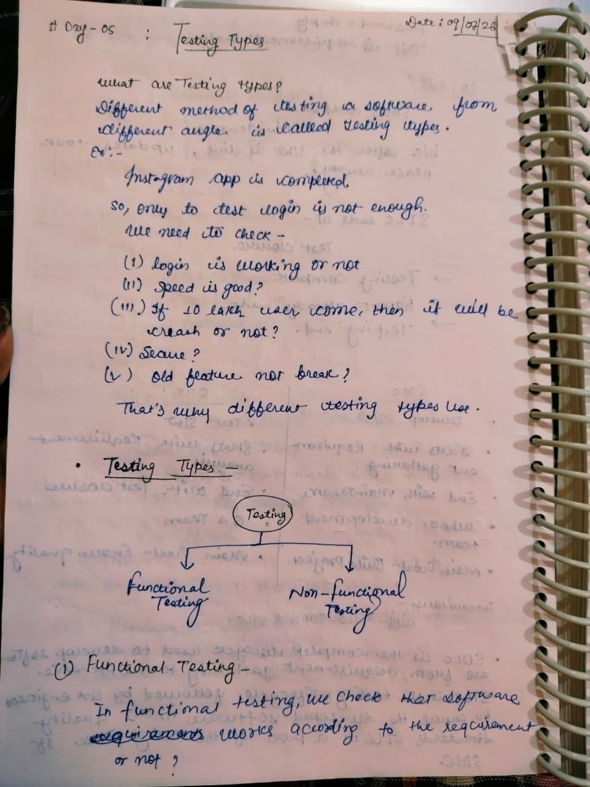
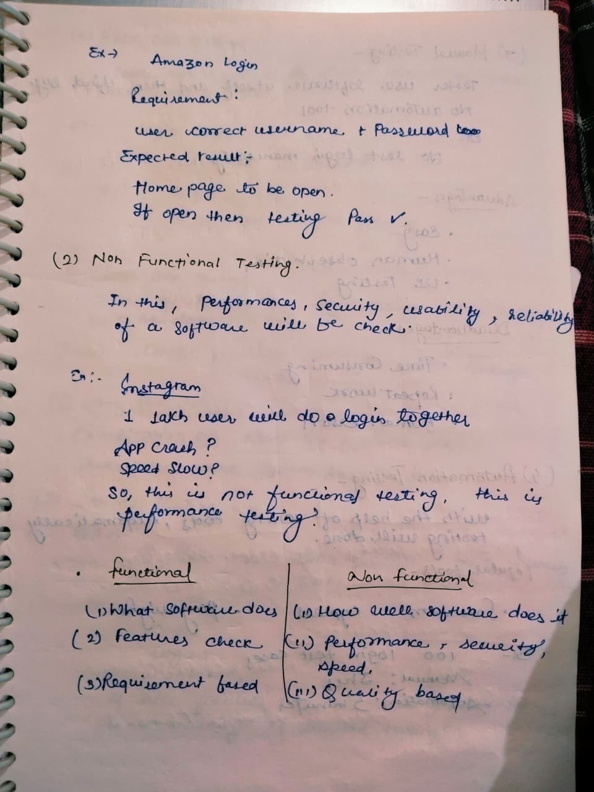
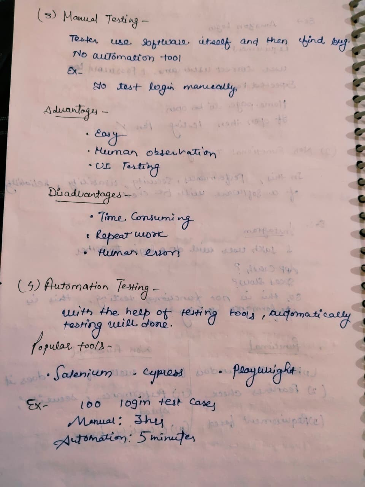
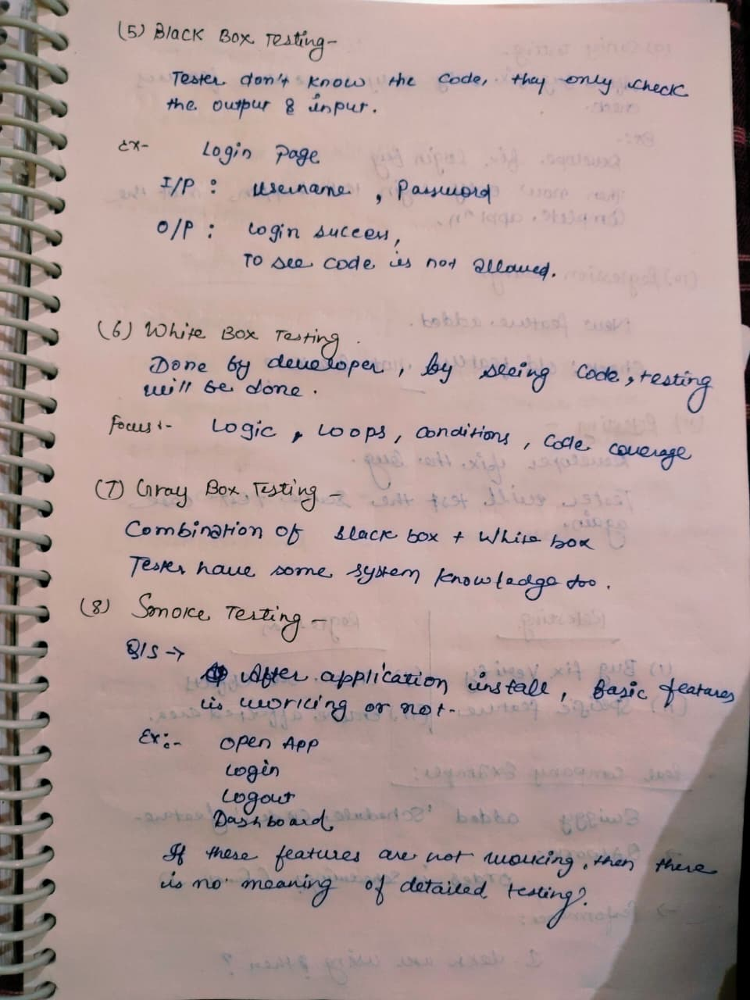
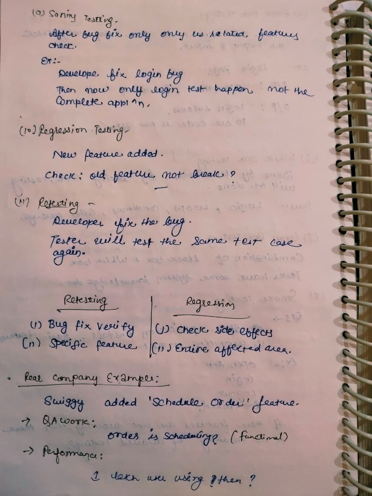
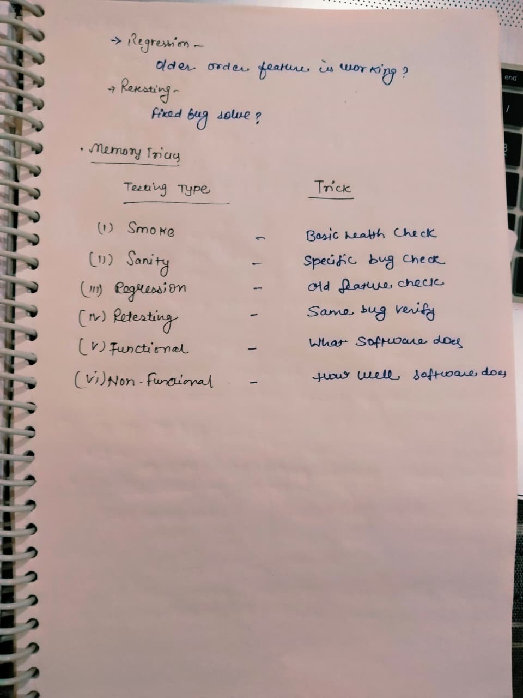

# Day 05 - Testing Types

## 📅 Date
09 July 2026

## 🎯 Topic
Testing Types

## 📚 What I Learned

- What are Testing Types?
- Functional Testing
- Non-Functional Testing
- Manual Testing
- Automation Testing
- Black Box Testing
- White Box Testing
- Gray Box Testing
- Smoke Testing
- Sanity Testing
- Regression Testing
- Retesting
- Functional vs Non-Functional Testing
- Manual vs Automation Testing
- Regression vs Retesting
- Real Company Example
- Memory Tricks for Testing Types

---

# 📝 My Notes

## 1️⃣ Testing Types Overview

---

## 2️⃣ Functional vs Non-Functional Testing

---

## 3️⃣ Manual vs Automation Testing

---

## 4️⃣ Black Box, White Box & Gray Box Testing

---

## 5️⃣ Smoke, Sanity, Regression & Retesting

---

## 6️⃣ Memory Tricks & Real Company Example

---

## 🎯 Learning Outcome

Today, I learned different software testing types and understood when each type is used in real-world projects. I also learned the differences between Functional and Non-Functional Testing, Manual and Automation Testing, Black Box, White Box, and Gray Box Testing, as well as Smoke Testing, Sanity Testing, Regression Testing, and Retesting.

I also understood:

- Requirement-based vs Quality-based Testing
- Human Testing vs Tool-based Testing
- Input & Output based Testing
- Basic Health Check using Smoke Testing
- Bug Verification using Retesting
- Side Effect Verification using Regression Testing
- Practical examples using Amazon, Instagram, and Swiggy applications

---

## 💼 Interview Takeaway

### Q. What is the difference between Regression Testing and Retesting?

**Answer:**

- **Retesting** is performed to verify that a specific bug has been fixed successfully by executing the same test case again.
- **Regression Testing** is performed to ensure that recent code changes or bug fixes have not affected existing functionalities of the application.

---

## 📌 Status

✅ Completed

---

**Learning one step at a time 🚀**
