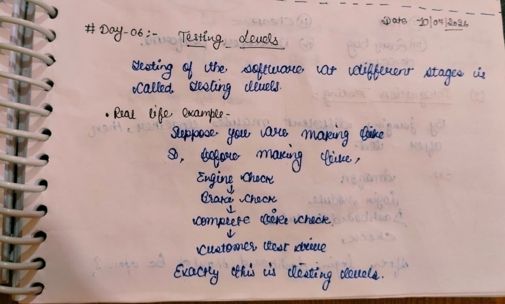
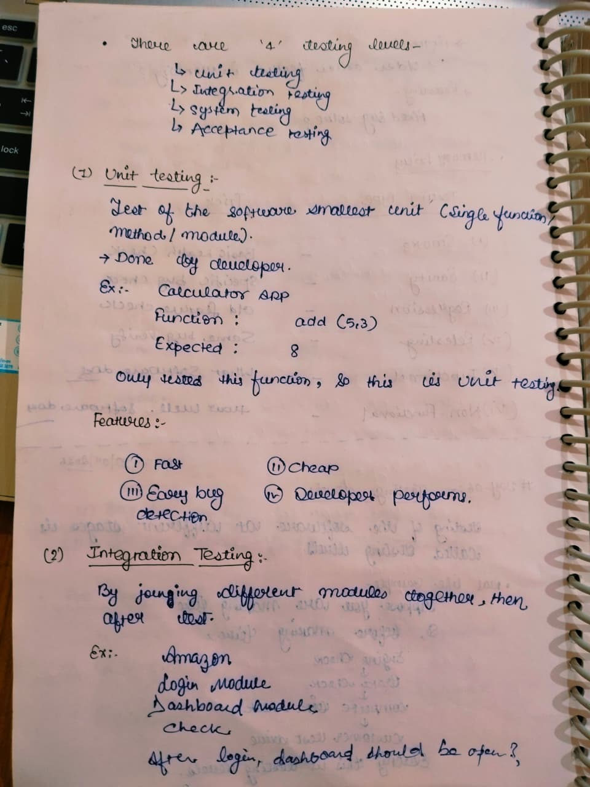
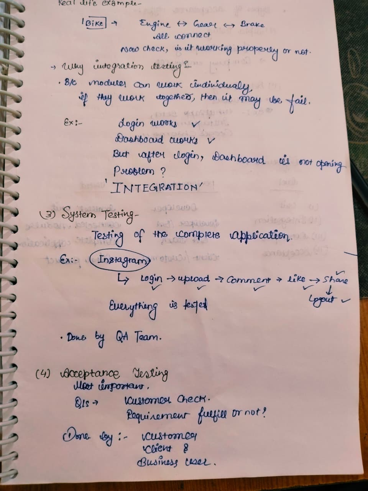
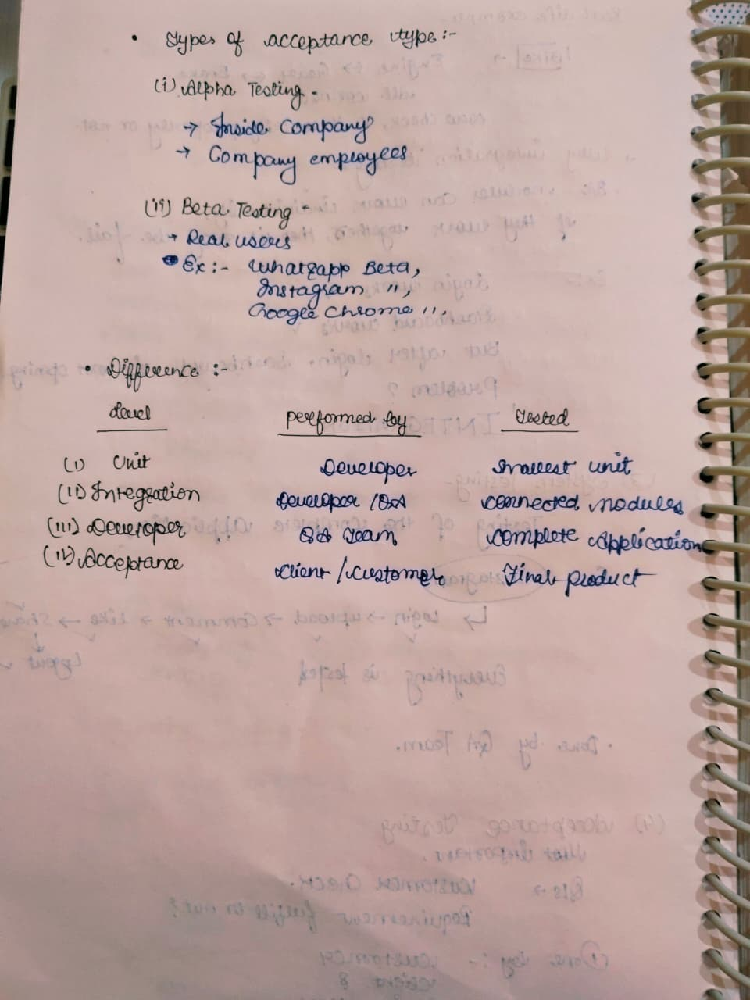

# Day 06 - Testing Levels

## 📅 Date
09 July 2026

## 🎯 Topic
Testing Levels

## 📚 What I Learned

- What are Testing Levels?
- Unit Testing
- Integration Testing
- System Testing
- Acceptance Testing
- Alpha Testing
- Beta Testing
- Difference between all Testing Levels
- Real-life examples of Testing Levels

---

# 📝 My Notes

## 1️⃣ Introduction to Testing Levels

---

## 2️⃣ Unit Testing & Integration Testing

---

## 3️⃣ System Testing & Acceptance Testing

---

## 4️⃣ Alpha Testing, Beta Testing & Testing Levels Summary

---

## 🎯 Learning Outcome

Today, I learned the four levels of software testing and understood how testing is performed at different stages of the Software Development Life Cycle (SDLC).

I also learned:

- Unit Testing for testing individual functions or modules
- Integration Testing for validating interactions between connected modules
- System Testing for testing the complete application
- Acceptance Testing for validating the software from the customer's perspective
- Difference between Alpha and Beta Testing
- Who performs each testing level and what is tested at every stage

---

## 💼 Interview Takeaway

### Q. What are the four Testing Levels?

**Answer:**

1. Unit Testing
2. Integration Testing
3. System Testing
4. Acceptance Testing

---

### Q. Who performs each Testing Level?

| Testing Level | Performed By |
|---------------|--------------|
| Unit Testing | Developer |
| Integration Testing | Developer / QA |
| System Testing | QA Team |
| Acceptance Testing | Client / Customer / Business User |

---

### Q. Difference between Alpha Testing and Beta Testing?

| Alpha Testing | Beta Testing |
|---------------|--------------|
| Performed inside the company | Performed by real users |
| Conducted by company employees | Conducted by end users |
| Done before Beta Testing | Final testing before release |

---

## 📌 Status

✅ Completed

---

**Learning one step at a time 🚀**
