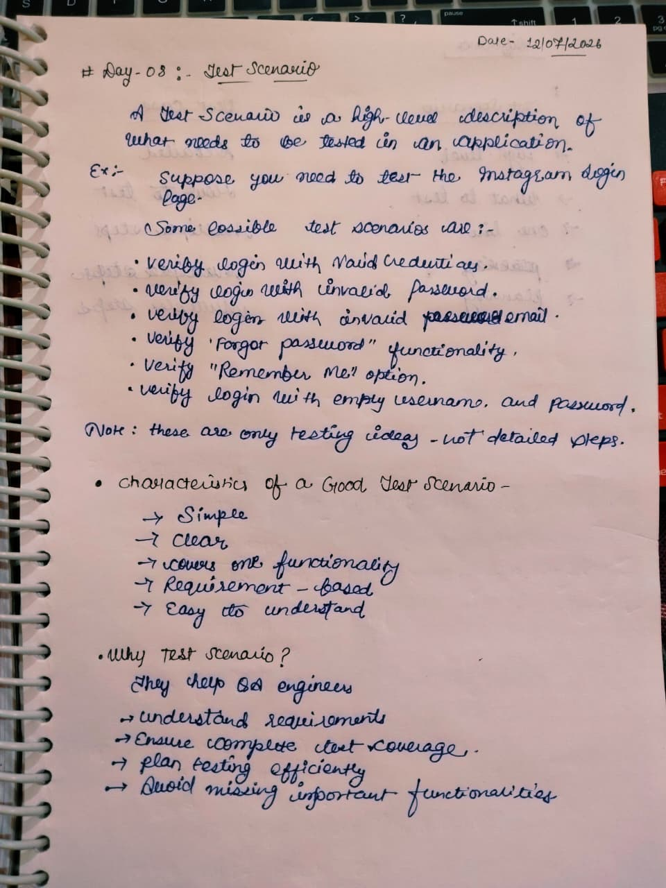
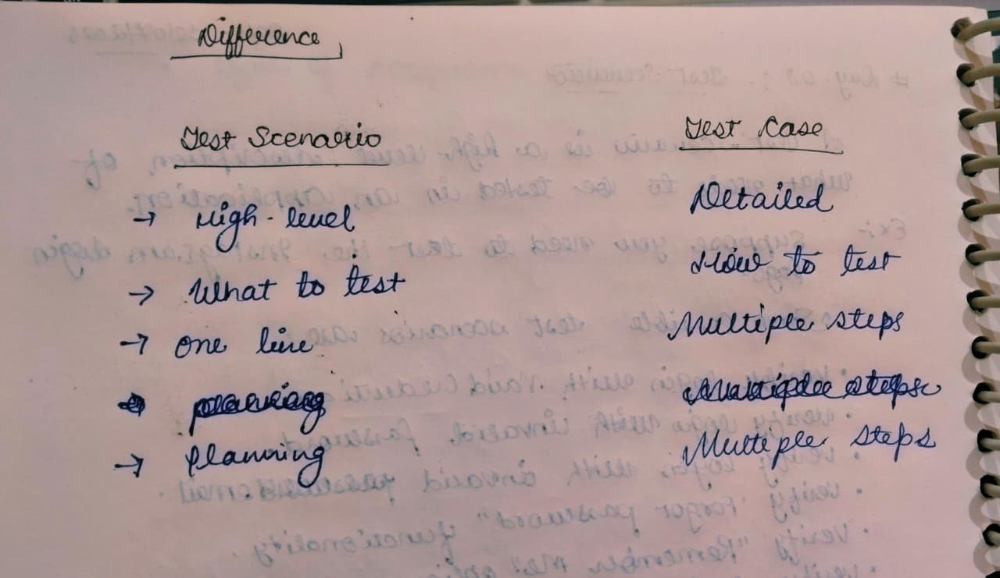

# Day 08 - Test Scenario

## 📅 Date
12 July 2026

## 🎯 Topic
Test Scenario

## 📚 What I Learned

- What is a Test Scenario?
- Characteristics of a Good Test Scenario
- Why Test Scenarios are Important
- Difference between Test Scenario and Test Case
- High-Level Testing Approach
- Requirement-Based Testing

---

# 📝 My Notes

## 1️⃣ Test Scenario Concepts

---

## 2️⃣ Test Scenario vs Test Case

---

## 🎯 Learning Outcome

Today, I learned that a **Test Scenario** is a high-level description of what needs to be tested in an application. It helps QA engineers understand the requirements, ensure complete test coverage, and avoid missing important functionalities.

I also understood the key differences between **Test Scenario** and **Test Case**, where a Test Scenario defines **what to test**, while a Test Case explains **how to test** with detailed steps.

---

## 💼 Interview Takeaway

### Q. What is a Test Scenario?

A Test Scenario is a high-level testing idea that describes **what functionality should be tested** in an application.

---

### Q. Why are Test Scenarios important?

- Helps understand requirements
- Ensures complete test coverage
- Improves test planning
- Reduces the chances of missing important functionalities

---

### Q. Difference between Test Scenario and Test Case?

| Test Scenario | Test Case |
|--------------|-----------|
| High-Level | Detailed |
| What to Test | How to Test |
| One-line idea | Multiple test steps |
| Used for Planning | Used for Execution |

---

## 📌 Status

✅ Completed

---

**Learning one step at a time 🚀**
