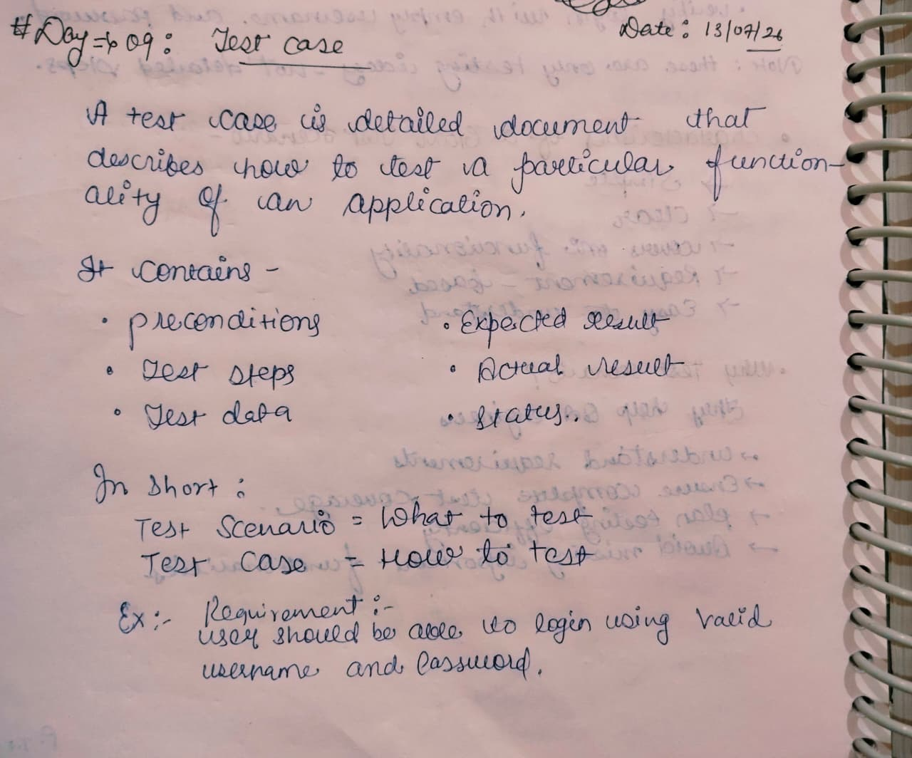
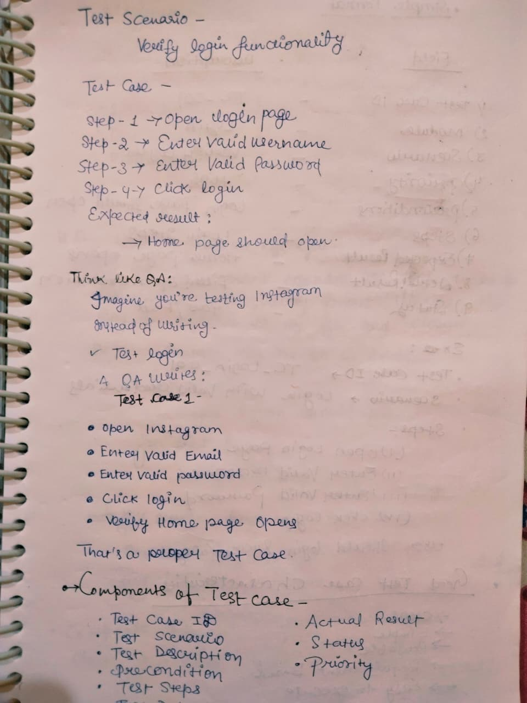
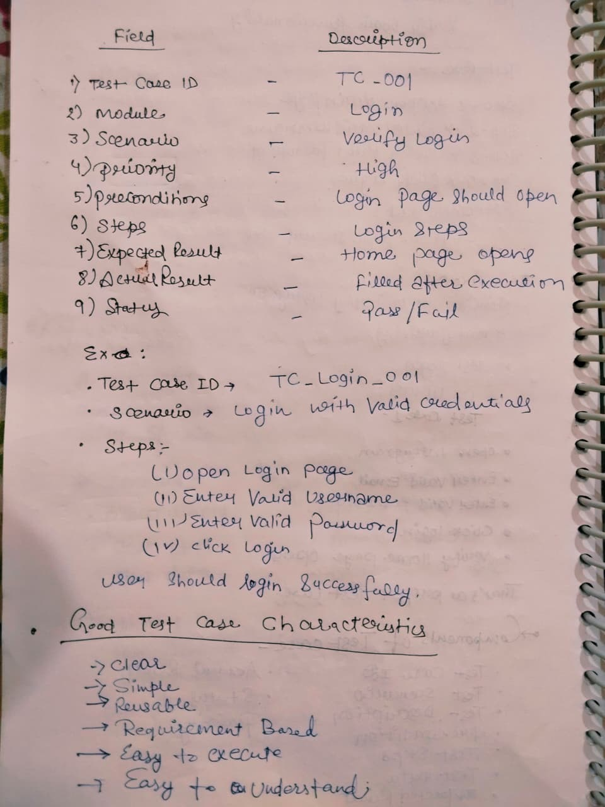
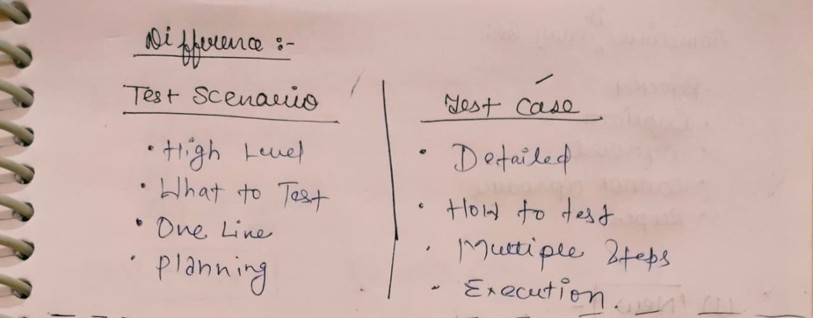

# Day 09 - Test Case

## 📅 Date
13 July 2026

## 🎯 Topic
Test Case

## 📚 What I Learned

- What is a Test Case?
- Difference between Test Scenario and Test Case
- Components of a Test Case
- Standard Test Case Format
- Login Test Case Examples
- Characteristics of a Good Test Case
- Importance of Test Cases
- Interview Questions on Test Cases

---

# 📝 My Notes

## 1️⃣ Introduction to Test Case

---

## 2️⃣ Components of a Test Case

---

## 3️⃣ Login Test Case Examples

---

## 4️⃣ Test Scenario vs Test Case

---

## 🎯 Learning Outcome

Today, I learned how to write professional Test Cases used in real software companies.

I understood the difference between Test Scenario and Test Case, learned the standard structure of a Test Case, and practiced writing login-related Test Cases with expected results.

I also learned why Test Cases are important for ensuring complete test coverage, improving documentation, and reducing missed defects.

---

## 📌 Status

✅ Completed

---

**Learning one step at a time 🚀**
