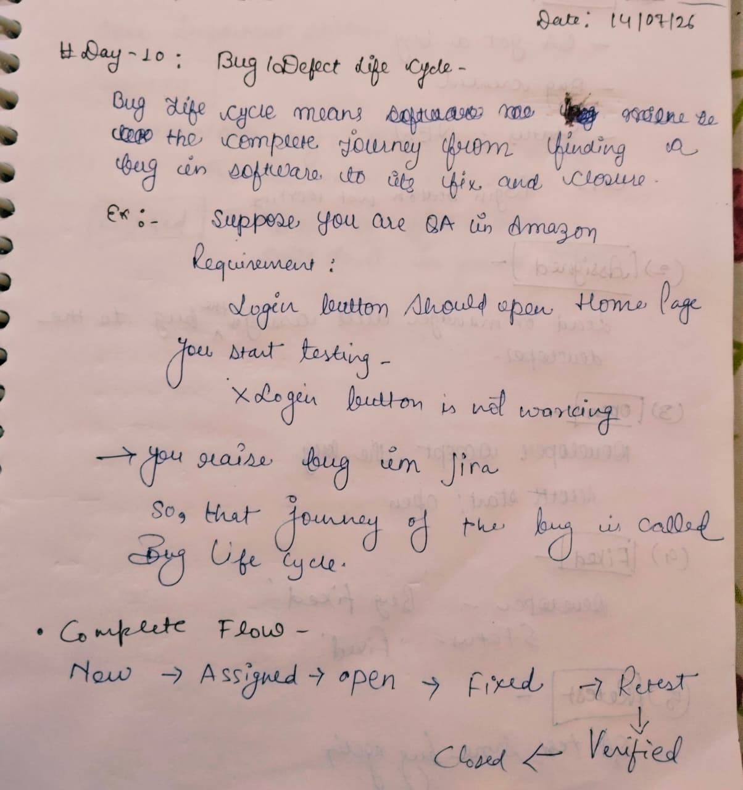
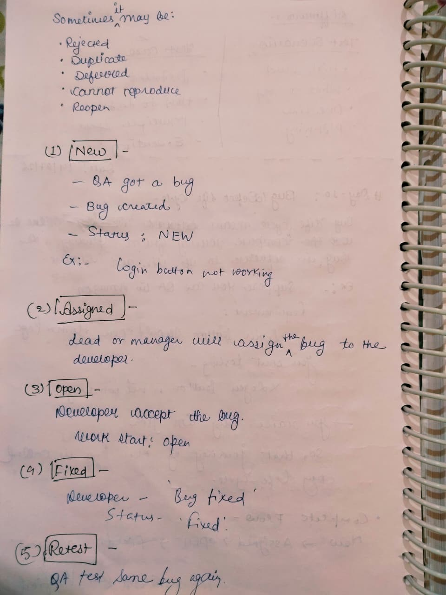
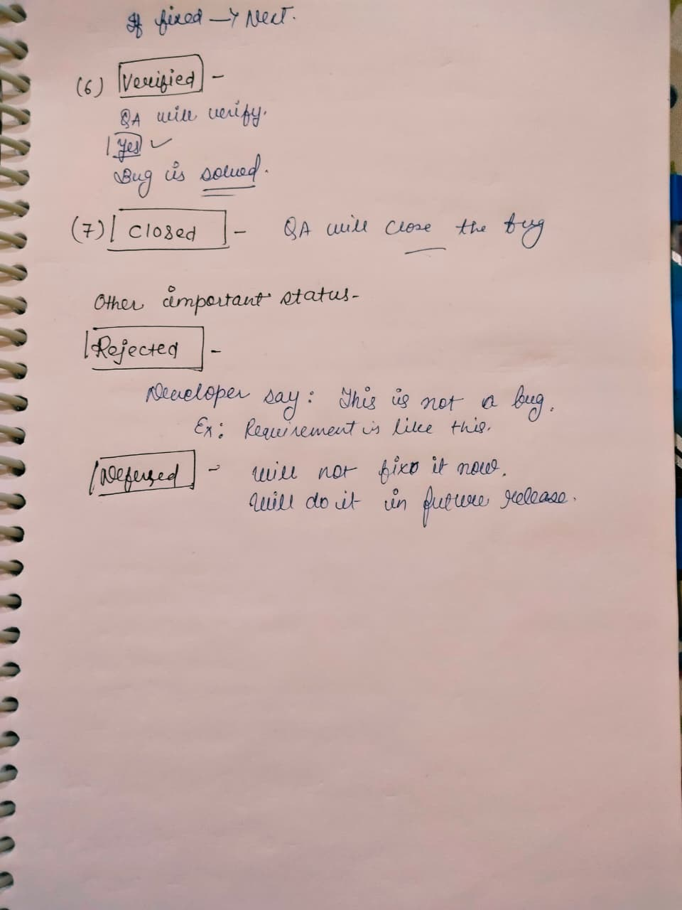

# Day 10 - Bug Life Cycle (Defect Life Cycle)

## 📅 Date
14 July 2026

## 🎯 Topic
Bug Life Cycle (Defect Life Cycle)

## 📚 What I Learned

- What is Bug Life Cycle?
- Why Bug Life Cycle is Important
- Complete Bug Status Flow
- New
- Assigned
- Open
- Fixed
- Retest
- Verified
- Closed
- Other Bug Statuses
  - Rejected
  - Duplicate
  - Deferred
  - Cannot Reproduce
  - Reopen

---

# 📝 My Notes

## 1️⃣ Introduction to Bug Life Cycle

---

## 2️⃣ Bug Status Flow

---

## 3️⃣ Bug Status Explanation

---

## 🎯 Learning Outcome

Today, I learned the complete Bug (Defect) Life Cycle followed in real software companies.

I understood how a bug moves through different stages—from being reported by a QA Engineer to being fixed by the developer, verified by QA, and finally closed.

I also learned the purpose of different bug statuses such as New, Assigned, Open, Fixed, Retest, Verified, Closed, Rejected, Deferred, Duplicate, Cannot Reproduce, and Reopen.

This topic helped me understand how QA teams collaborate with developers using bug tracking tools like Jira.

---

## 📌 Status

✅ Completed

---

**Learning one step at a time 🚀**
