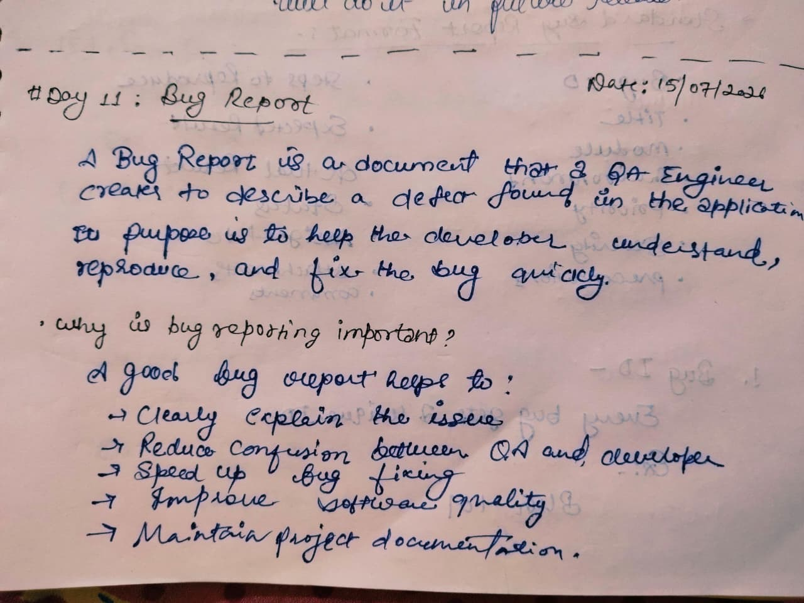
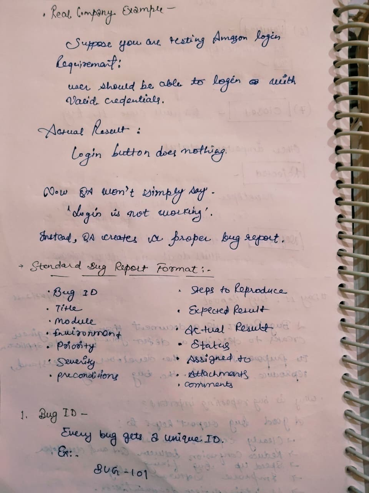
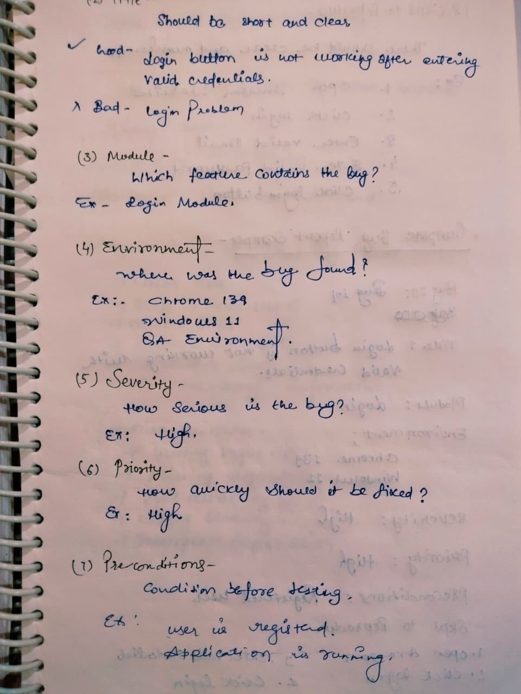
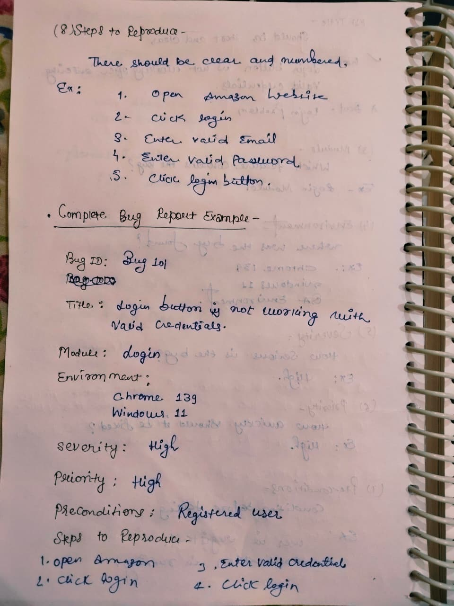
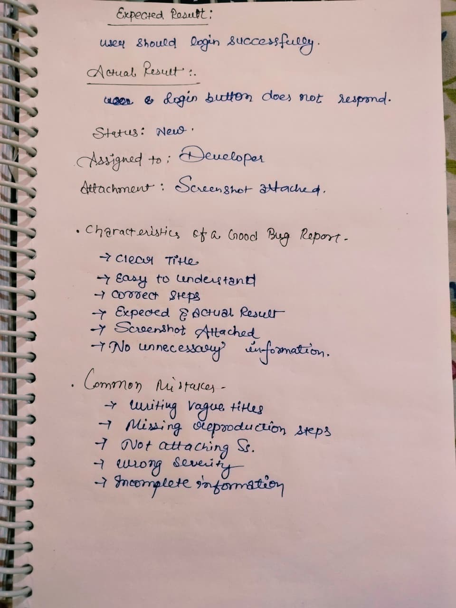

# Day 11 - Bug Report

## 📅 Date
15 July 2026

## 🎯 Topic
Bug Report

## 📚 What I Learned

Today I learned how QA Engineers create professional Bug Reports that help developers identify and fix software defects efficiently.

### Topics Covered

- What is a Bug Report?
- Standard Bug Report Format
- Bug ID
- Title
- Module
- Environment
- Severity vs Priority
- Preconditions
- Steps to Reproduce
- Expected Result
- Actual Result
- Status
- Assigned To
- Attachments
- Characteristics of a Good Bug Report
- Common Reporting Mistakes

---

## 📸 Notes

### Bug Report Overview

### Bug Report Fields

### Steps to Reproduce

### Sample Bug Report

### Best Practices & Common Mistakes

---

## 🎯 Learning Outcome

- Understood the purpose of Bug Reports.
- Learned the standard bug reporting format.
- Practiced creating a sample bug report.
- Learned how to write clear and effective bug reports used in real QA projects.

---

## 📌 Status

✅ Completed

---

**Learning one step at a time 🚀**
